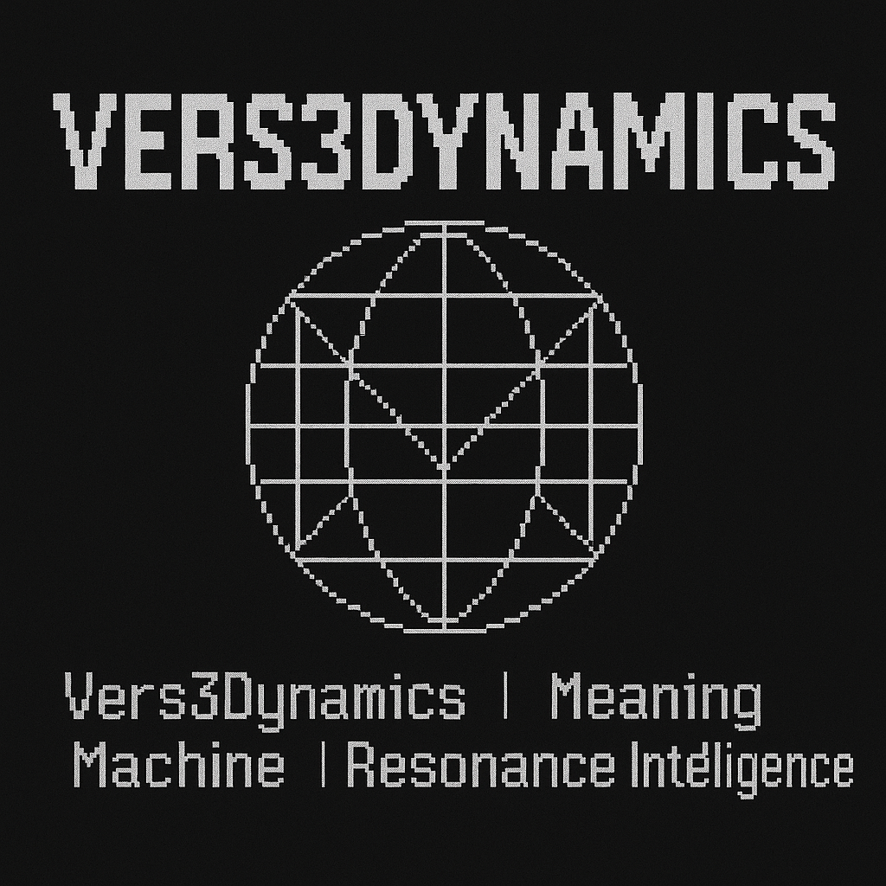

# Resona

**Where ideas find their frequency**

Resona is a next-generation open-source platform — a decentralized social network and research playground where scientists, engineers, and creators publish, share, and evolve frontier experiments together.



## 🌌 Vision

Resona is the **GitHub + Reddit + Hugging Face** of future science — a living network for open discovery.

- Users post research notes, code, data, and prototypes
- Others can **Resonate** with or **Fork** projects to evolve them further  
- Every project contributes to the world's first social graph of scientific resonance

## ✨ Key Features

### 🔬 Research Publishing
- Markdown-based project pages with syntax highlighting
- Upload code, datasets, and research documentation
- AI-powered auto-summarization and tagging
- Support for multiple license types (open, remixable, attribution)

### 🔊 Social Resonance
- **Resonate** — Like projects that inspire you
- **Fork** — Create derivative works and evolutions
- **Discuss** — Collaborative comment threads
- Track resonance scores and scientific impact

### 👥 Community & Collaboration
- User profiles with resonance graphs
- Public Labs for team collaboration
- Follow researchers and topics
- Discover related projects through AI recommendations

### 🎨 Design Philosophy
- **Aesthetic**: Sleek, dark, minimal, and luminous
- **Colors**: Deep black with cyan, violet, and silver gradients
- **Motion**: Smooth animations and particle effects
- **Typography**: Modern, clean (Inter font family)
- **Background**: Animated particles representing live resonance

## 🚀 Getting Started

### Prerequisites
- Node.js (v18+ recommended)
- npm or yarn

### Installation

```bash
# Clone the repository
git clone topherchris420/resona-lab-network

# Navigate to project directory
cd resona

# Install dependencies
npm install

# Start development server
npm run dev
```

The app will be available at `http://localhost:8080`

## 🛠️ Tech Stack

### Frontend
- **React 18** - UI framework
- **TypeScript** - Type safety
- **Vite** - Build tool and dev server
- **Tailwind CSS** - Styling and design system
- **Shadcn UI** - Component library
- **React Router** - Navigation
- **Lucide Icons** - Icon system

### Design System
- Glass-morphism UI components
- Animated gradient backgrounds
- Particle system for visual effects
- Custom design tokens in HSL color space
- Responsive and accessible components

## 📁 Project Structure

```
resona/
├── public/               # Static assets
│   ├── favicon.png      # App icon
│   └── robots.txt       # SEO configuration
├── src/
│   ├── assets/          # Images and media
│   ├── components/      # React components
│   │   ├── ui/         # Shadcn UI components
│   │   ├── Header.tsx
│   │   ├── ProjectCard.tsx
│   │   ├── ParticleBackground.tsx
│   │   └── AnimatedBackground.tsx
│   ├── pages/          # Route pages
│   │   ├── Home.tsx
│   │   ├── ProjectDetail.tsx
│   │   ├── Profile.tsx
│   │   ├── Auth.tsx
│   │   └── Create.tsx
│   ├── lib/            # Utilities
│   ├── hooks/          # Custom React hooks
│   ├── index.css       # Global styles & design system
│   ├── App.tsx         # Root component
│   └── main.tsx        # Entry point
├── tailwind.config.ts  # Tailwind configuration
├── vite.config.ts      # Vite configuration
└── package.json        # Dependencies
```

## 🤝 Contributing

We welcome contributions from the community! Here's how you can help:

1. **Fork the repository**
2. **Create a feature branch**: `git checkout -b feature/amazing-feature`
3. **Commit your changes**: `git commit -m 'Add amazing feature'`
4. **Push to the branch**: `git push origin feature/amazing-feature`
5. **Open a Pull Request**

### Development Guidelines
- Follow the existing code style and patterns
- Use TypeScript for type safety
- Write descriptive commit messages
- Add comments for complex logic
- Test your changes thoroughly
- Update documentation as needed

## 📄 License

This project is open source. License details coming soon.

## 🌐 Links

- **Website**: [resona.lovable.app](https://resona.lovable.app)
- **Documentation**: Coming soon
- **Community Discord**: Coming soon
- **GitHub**: This repository

## 💡 Philosophy

> "Resona is a living network of open science and creation."

We believe that the future of scientific discovery is:
- **Open** - Knowledge should be freely shared
- **Collaborative** - Great ideas emerge from connection
- **Dynamic** - Research evolves through iteration
- **Resonant** - Quality ideas naturally amplify

## 📧 Contact

For questions, suggestions, or collaboration opportunities:
- Create an issue in this repository
- Join our community channels (coming soon)
- Contact the team (details coming soon)

---

**Built with ❤️ by the Resona community**

*Vers3Dynamics | Meaning Machine | Resonance Intelligence*
